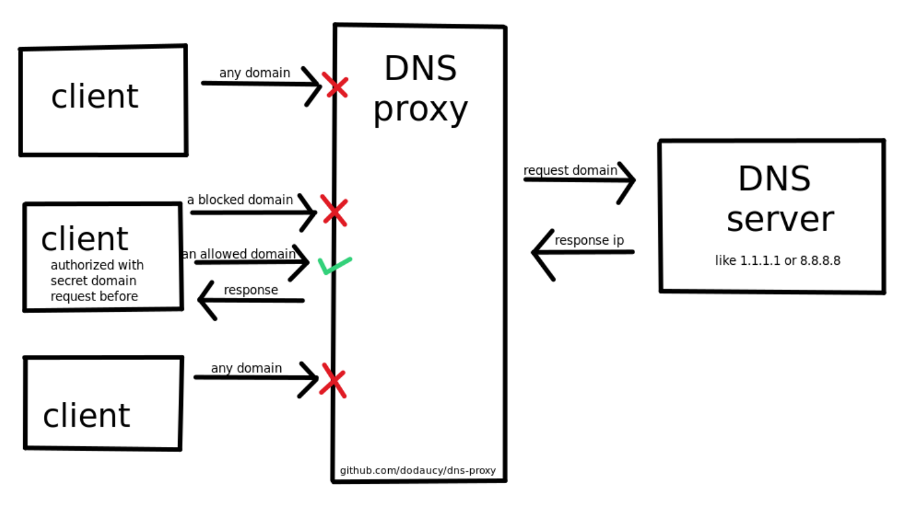

# DNS Proxy

Simple python DNS proxy with auth and blocklist.



## Docker

```bash
git clone https://github.com/dodaucy/dns-proxy.git
cd dns-proxy

docker build -t dns-proxy .

docker run -d \  # Run in background
  -p $(hostname -I | awk '{print $1}'):53:5353/udp \
  -v ./data/config.yaml:/app/config.yaml \
  --name dns-proxy \
  --restart always \
  dns-proxy

nano data/config.yaml  # Edit config

docker logs -f dns-proxy  # Log
```

## Without docker

```bash
git clone https://github.com/dodaucy/dns-proxy.git
cd dns-proxy

python3 -m venv venv

venv/bin/pip install -Ur requirements.txt

cp example_config.yaml config.yaml
nano config.yaml  # Edit config

venv/bin/python main.py  # Run
```
